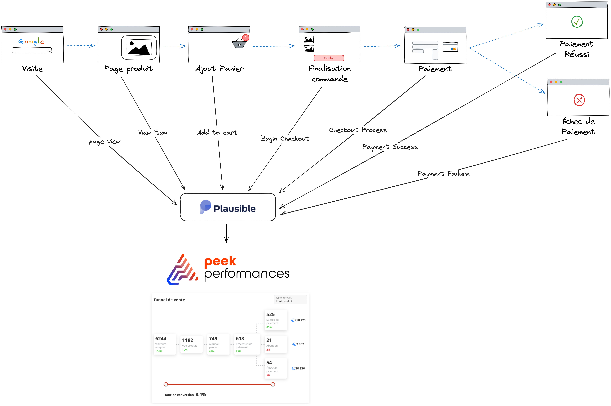
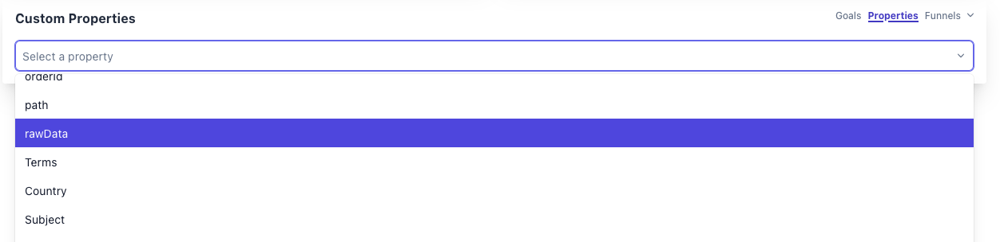
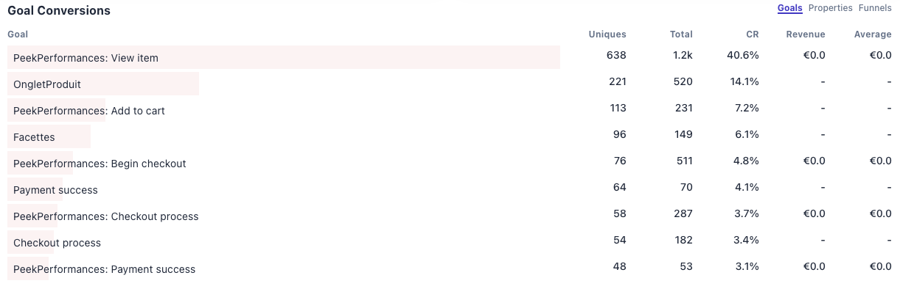
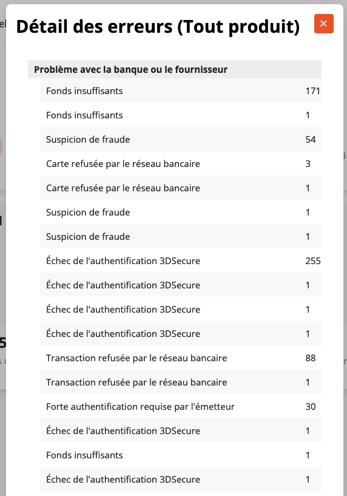

# Guide d’intégration des ventes dans PeekPerformances


## Système de remontée de données de navigation et de réconciliation avec les données de vente



À chaque étape de la navigation du visiteur, des événements sont remontés à plausible.

## Détail des événements remontés à Plausible

### Intégration Plausible

Il existe plusieurs modes d’intégration (package npm, modules prestashop etc.) disponibles, facilitant et optimisant l’intégration du script plausible : https://plausible.io/docs/integration-guides#prestashop

### page_view Plausible

Pas besoin de configurer un événement spécifique. Ce sont les visiteurs uniques du site.

**Note**: Plausible est en train d’intégrer la possibilité d’ajouter des propriétés personnalisées aux page views, ce qui permettra à terme de remonter la catégorie du produit sur les pages concernées, permettant d’ajouter une étape "Visiteurs pages catégorie de produits". (ref: https://github.com/plausible/analytics/issues/134)

### Campagnes de pubs: Plausible

Pas besoin de configurer un événement spécifique. Les informations sont récupérées automatiquement dans Plausible.
**Intégration**: Afin de préciser à Plausible que certains utilisateurs sont arrivés via un adsense, il faut passer certains arguments dans l’url de la page.
https://plausible.io/docs/manual-link-tagging

```
https://my_domain/?source=Sea&utm_campaign={campaign_name}
```

La source _Sea_ permet de déterminer l’ensemble des utilisateurs venant via un adsense et le nom de la campagne sert à filtrer les données pour étudier les performances de ladite campagne de pub.
**Seuls ces paramètres sont essentiels. Cela ne vous empêche pas d’en rajouter d’autres, ils ne seront pas pris en compte.**

### Événements : Plausible Goals

Les événements suivants sont, dans la terminologie plausible, des "goals". Vous trouverez la manière d’envoyer de tels événements dans la documentation plausible ici: https://plausible.io/docs/custom-event-goals

**Dans les descriptions d’événements ci-dessous, seules les propriétés nécessaires au bon fonctionnement du suivi des ventes a été documenté. <span style='color:red'>Il est possible et même souvent recommandé</span> d’enrichir ces événements d’autres propriétés pour enrichir la classification dans le dashboard plausible.**

Pour vérifier la bonne réception des propriétés dans Plausible, dans le dernier volet


Vue des Goals dans Plausible


L’ensemble de ces goals doit remonter une propriété commune sous la forme d’un JSON stringify. Cette propriété comporte une liste de produits comprenant catégorie, sous-catégorie, marchand et prix. Ceci vous permet de filtrer vos données de vente par l’ensemble de ces éléments.

**Dans le cas où l’un de ces filtres ne vous intéresse pas, vous pouvez renvoyer un nom commun à l’ensemble de vos produits pour ne pas altérer le bon fonctionnement de l’outil.**

A ce produit peut s’ajouter d’autres propriétés comme détaillé ci-dessous.

### Commun à tous les événements : Tracking des revenus dans Plausible

Pour permettre d’avoir des données de revenus directement dans Plausible, il suffit d’ajouter dans chaque événement un attribut `revenue` avec les deux propriétés `currency` et `amount`, pour remonter le montant total concerné par l’événement. Ci-dessous un exemple. Cette partie est optionnelle pour peekPerformance, mais constitue un ajout complémentaire intéressant dans le dashboard Plausible. Dans la suite, cette propriété a été incluse dans toutes les descriptions d’événements.

```javascript
plausible("<Nom de l’événement>", {
  props: {
    //...<données de l’événement>
  },
  revenue: { currency: "EUR", amount: 13 },
});
```

### PeekPerformances: View item

Cet événement est déclenché à l’affichage d’un produit donné. Dans le cas où plusieurs produits sont affichés, ils peuvent tous être remontés sous la forme d’une liste de produits. Ici, ajouter l’attribut revenue n’a pas forcément de sens car il peut y avoir plusieurs produits sans action concrète de volonté d’achat.

###### Exemple

```javascript
const rawData = {
  products: [
    {
      category: "Nourriture pour chats",
      subCategory: "Croquettes",
      merchant: "Marchand",
      price: 13,
    },
  ],
};
plausible("PeekPerformances: View item", {
  props: {
    rawData: JSON.stringify(rawData),
  },
});
```

### PeekPerformances: Add to cart

Cet événement est déclenché à l’ajout d’un produit au panier.

###### Exemple

```javascript
const rawData = {
  products: [
    {
      category: "Nourriture pour chats",
      subCategory: "Croquettes",
      merchant: "Marchand",
      price: 13,
    },
  ],
};
plausible("PeekPerformances: Add to cart", {
  props: {
    rawData: JSON.stringify(rawData),
  },
  revenue: { currency: "EUR", amount: 13 },
});
```

### PeekPerformances: Begin checkout

Cet événement est déclenché au début du processus de validation de la commande : l’utilisateur clique sur le bouton "valider la commande". Pour cet évènement et les prochains, la propriété products correspond aux éléments du panier.

###### Exemple

```javascript
const rawData = {
  products: [
    {
      category: "Nourriture pour chats",
      subCategory: "Croquettes",
      merchant: "Marchand",
      price: 13,
    },
    {
      category: "Jouets pour chats",
      merchant: "Marchand",
      price: 14,
    },
  ],
};
plausible("PeekPerformances: Begin checkout", {
  props: {
    rawData: JSON.stringify(rawData),
  },
  revenue: { currency: "EUR", amount: 27 },
});
```

### PeekPerformances: Checkout process

Cet événement est déclenché quand l’utilisateur choisit un mode de paiement et est redirigé vers la plateforme de paiement.

###### Exemple

```javascript
const rawData = {
  products: [
    {
      category: "Nourriture pour chats",
      subCategory: "Croquettes",
      merchant: "Marchand",
      price: 13,
    },
  ],
};
plausible("PeekPerformances: Checkout process", {
  props: {
    rawData: JSON.stringify(rawData),
  },
  revenue: { currency: "EUR", amount: 13 },
});
```

### PeekPerformances: Payment success

Cet événement est déclenché une fois le paiement validé et l’utilisateur redirigé vers la page de confirmation de commande du marchand. On y retrouve le nombre d’essais avant que le paiement ait réussi ainsi que la méthode de paiement.

###### Exemple

```javascript
const rawData = {
  products: [
    {
      category: "Nourriture pour chats",
      subCategory: "Croquettes",
      merchant: "Marchand",
      price: 13,
    },
  ],
  attempts: 2,
  paymentMethod: "Carte bancaire",
};
plausible("PeekPerformances: Payment success", {
  props: {
    rawData: JSON.stringify(rawData),
  },
  revenue: { currency: "EUR", amount: 13 },
});
```

### PeekPerformances: Payment failure

Cet événement est déclenché en cas d’échec de paiement, qui peut avoir plusieurs raisons possibles.
En plus, le code de retour du paiement doit être ajouté, utilisé pour donner le détails de raisons d’échec.



###### Exemple

```javascript
const rawData = {
  products: [
    {
      category: "Nourriture pour chats",
      subCategory: "Croquettes",
      merchant: "Marchand",
      price: 13,
    },
  ],
  attempts: 2,
  execCode: 4003,
};
plausible("PeekPerformances: Payment failure", {
  props: {
    rawData: JSON.stringify(rawData),
  },
  revenue: { currency: "EUR", amount: 13 },
});
```

La liste des codes d’erreurs à renvoyer en fonction de la raison de l’échec est la suivante (la liste peut varier en fonction du prestataire de paiement, si différent, il est possible d’intégrer une nouvelle liste de codes) :

```javascript
const ERRORCODEFR = {
  "0000": "Successful operation",
  "0001": "3-D Secure authentication required",
  "0002": "Redirection required to finish a transaction",
  "0003": "Transaction in progress, pending notification",
  1001: "Paramètre manquant",
  1002: "Paramètre invalide",
  1003: "Erreur de HASH",
  1004: "Protocole non supporté",
  1005: "Mauvaise requête, regardez la documentation pour faire une requête en mode POST",
  1006: "Paramètres non acceptés par les requêtes GET",
  1007: "Montant du panier différent de celui de la transaction",
  2001: "ALIAS non trouvé",
  2002: "Opération de référence introuvable",
  2003: "Opération de référence non réussie",
  2004: "Opération de référence non remboursable",
  2005: "Opération de référence non capturable",
  2006: "Opération de référence non terminée",
  2007: "Montant de capture invalide",
  2008: "Montant de remboursement invalide",
  2009: "Autorisation expirée",
  2010: "Programme d'installation introuvable",
  2011: "Programme d'installation déjà interrompu",
  2012: "Programme d'installation déjà terminé",
  2013: "Fichier introuvable",
  2014: "Fichier non conforme",
  2015: "Opération de référence non annulable",
  2016: "Ressource déjà existante",
  2017: "L'opération de référence n'est pas encore disponible, réessayez plus tard",
  2018: "HFTOKEN introuvable ou expiré",
  2019: "Montant annulé invalide",
  2020: "Alias expiré",
  3001: "Compte désactivé",
  3002: "Adresse IP non autorisée",
  3003: "Transaction non autorisée",
  3004: "Limite du taux de transaction dépassée",
  3006: "Marchand invalide pour ce compte",
  3008: "Option de paiement non configurée",
  4001: "Transaction refusée par le réseau bancaire",
  4002: "Fonds insuffisants",
  4003: "Carte refusée par le réseau bancaire",
  4005: "Suspicion de fraude",
  4008: "Échec de l'authentification 3DSecure",
  4009: "Authentification 3DSecure abandonnée ou expirée",
  4010: "Transaction invalide",
  4011: "Transaction dupliquée",
  4012: "Données de carte invalides",
  4013: "Transaction refusée par le réseau bancaire pour ce client",
  4014: "Carte ne possédant pas le '3-D Secure-enrolled'",
  4015: "Transaction expirée",
  4016: "Transaction refusée par le terminal de paiement",
  4017: "Expiration du formulaire (choisie par le marchand)",
  4018: "Paiement récurent révoqué pour cet utilisateur",
  4019: "La banque refusera toute prochaine transaction de ce client",
  4020: "Forte authentification requise par l'émetteur",
  4021: "Opération non permise / no supportée",
  5001: "Échec du protocole d'échange",
  5002: "Erreur du réseau bancaire",
  5004: "Temps imparti dépassé, une réponse sera envoyée à l'URl de notification (seulement pour les connections directes Visa / masterCard)",
  5005: "Erreur de l'authentification 3-D Secure",
  5006: "Réponse inatendue de la banque",
  6001: "Transaction déclinée par le site marchand",
  6002: "Transaction déclinée",
  6003: "Le propriétaire de la carte a déjà contesté une transaction",
  6004: "Transaction déclinée par le site marchand et/ou les règles de la plateforme",
  6005: "Carte non enregistrée ou 3-D secure indisponible",
  6006: "Méthode de paiement bloquée",
  6007: "Opération interdite par le réseau bancaire",
};
```
